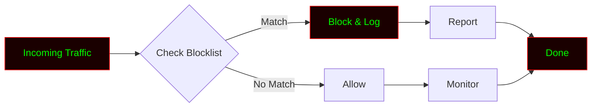

# NetShiled


<!-- ═══════════════════════════════════════════════════════════════════════ -->
<!--                        NETSHIELD - README.md                            -->
<!--              Professional IP & Domain Blocker Documentation             -->
<!-- ═══════════════════════════════════════════════════════════════════════ -->

<div align="center">

# 🛡️ NETSHIELD

### `Block • Filter • Protect`

**A Python-based IP and domain blocker for suspicious traffic.**

[](https://github.com/anonmoty/NetShiled)
[](https://python.org)
[](LICENSE)
[](https://github.com/anonmoty/NetShiled)
[](https://github.com/anonmoty/NetShiled)

</div>

---

```
████████████████████████████████████████████████████████████████████████
█                                                                      █
█   ███╗   ██╗███████╗████████╗███████╗██╗  ██╗██╗███████╗██╗     ██████╗ 
█   ████╗  ██║██╔════╝╚══██╔══╝██╔════╝██║  ██║██║██╔════╝██║     ██╔══██╗
█   ██╔██╗ ██║█████╗     ██║   ███████╗███████║██║█████╗  ██║     ██║  ██║
█   ██║╚██╗██║██╔══╝     ██║   ╚════██║██╔══██║██║██╔══╝  ██║     ██║  ██║
█   ██║ ╚████║███████╗   ██║   ███████║██║  ██║██║███████╗███████╗██████╔╝
█   ╚═╝  ╚═══╝╚══════╝   ╚═╝   ╚══════╝╚═╝  ╚═╝╚═╝╚══════╝╚══════╝╚═════╝ 
█                                                                      █
█                    [ Block | Filter | Protect ]                      █
█                                                                      █
████████████████████████████████████████████████████████████████████████
```

---

## ⚠️ Disclaimer

```
╔══════════════════════════════════════════════════════════════════════╗
║                                                                      ║
║   NETSHIELD is built for EDUCATIONAL and RESEARCH purposes only.     ║
║                                                                      ║
║   ▸ Use ONLY on networks and systems you own or have permission for. ║
║   ▸ Unauthorized blocking of traffic is ILLEGAL.                     ║
║   ▸ Follow ethical guidelines and local laws at all times.           ║
║   ▸ The author is NOT responsible for any misuse.                    ║
║                                                                      ║
║   Protect responsibly. Learn ethically. Defend proactively.          ║
║                                                                      ║
╚══════════════════════════════════════════════════════════════════════╝
```

---

## 🎯 What Is NetShield?

**NetShield** is a Python-based **IP and domain blocker** designed to help security researchers and network admins block suspicious traffic. It works by maintaining a blocklist of malicious IPs and domains, and filtering incoming/outgoing connections in real-time.

Built for:
- 🛡️ Network admins
- 🔬 Security researchers
- 🎓 Students learning network security
- 🧪 Threat hunters

---

## ✨ Features

```
┌─────────────────────────────────────────────────────────────────────┐
│  [01] 🚫 IP Blocker           → Blocks suspicious IPs                │
│  [02] 🌐 Domain Blocker       → Blocks malicious domains             │
│  [03] 📋 Blocklist Manager    → Add/remove entries easily            │
│  [04] 🔍 Live Monitor         → Real-time connection monitoring      │
│  [05] 📊 Traffic Logger       → Logs blocked traffic                 │
│  [06] ⚡ Multi-Threaded       → Fast parallel filtering              │
│  [07] 🎨 Terminal UI          → Clean hacker-style display           │
│  [08] 📝 JSON Reports         → Machine-readable logs                │
│  [09] 🔧 Custom Rules         → User-defined block rules             │
│  [10] 🛡️ Whitelist Support    → Exempt trusted IPs/domains           │
└─────────────────────────────────────────────────────────────────────┘
```

---

## 🚀 Installation

```bash
# Clone
git clone https://github.com/anonmoty/NetShiled.git
cd NetShiled

# Install dependencies
pip install -r requirements.txt

# Run
python netshield.py --help
```

**One-liner:**

```bash
git clone https://github.com/anonmoty/NetShiled.git && cd NetShiled && pip install -r requirements.txt && python netshield.py --help
```

---

## 🎯 Usage

```bash
# Block an IP
python netshield.py --block-ip 192.168.1.100

# Block a domain
python netshield.py --block-domain malicious.com

# Load blocklist from file
python netshield.py --load blocklist.txt

# Live monitor mode
python netshield.py --monitor

# Full protection mode
python netshield.py --monitor --blocklist blocklist.txt --output logs/traffic.json
```

### CLI Flags

```
┌─────────────────────────────────────────────────────────────────────┐
│  --block-ip       →  Block specific IP                              │
│  --block-domain   →  Block specific domain                          │
│  --load           →  Load blocklist from file                       │
│  --monitor        →  Live traffic monitoring                        │
│  --output         →  Log output path                                │
│  --whitelist      →  Exempt trusted IPs/domains                     │
│  --verbose        →  Verbose logging                                │
│  --help           →  Show help                                      │
└─────────────────────────────────────────────────────────────────────┘
```

---

## 🧠 How It Works



1. **Capture** — Intercepts incoming traffic
2. **Check** — Compares against blocklist
3. **Block** — Drops matching connections
4. **Log** — Records blocked attempts
5. **Report** — Outputs structured logs

---

## 📁 Structure

```
NetShield/
├── netshield.py
├── core/
│   ├── blocker.py
│   ├── monitor.py
│   ├── rules.py
│   └── reporter.py
├── blocklists/
│   ├── ips.txt
│   └── domains.txt
├── logs/
├── tests/
├── requirements.txt
├── LICENSE
└── README.md
```

---

## 📸 Demo

```
██████████████████████████████████████████████████████████████████████
█                                                                    █
█   NETSHIELD v1.0.0                                                 █
█   ───────────────────────────────────────────────────────────      █
█                                                                    █
█   [✓] Blocklist Loaded: 1,247 entries                              █
█   [✓] Mode: Live Monitor                                           █
█   [→] Monitoring traffic...                                        █
█                                                                    █
█   [████████████████████████░░░░░░] 80%                             █
█                                                                    █
█   [!] BLOCKED: 192.168.1.100  →  Known malicious IP                █
█   [!] BLOCKED: malware.com    →  Phishing domain                   █
█   [✓] Traffic logged: logs/traffic_2024.json                       █
█                                                                    █
█                      Stay Protected! 🛡️                            █
█                                                                    █
██████████████████████████████████████████████████████████████████████
```

---

## 🛠️ Requirements

```txt
requests>=2.28.0
colorama>=0.4.6
tqdm>=4.65.0
rich>=13.0.0
scapy>=2.5.0
```

```bash
pip install -r requirements.txt
```

---

## 🎨 Terminal Theme

NetShield uses a **red + green** hacker palette:

```python
THEME = {
    "primary":   "\033[38;5;196m",  # Bright Red
    "secondary": "\033[38;5;46m",   # Matrix Green
    "accent":    "\033[38;5;214m",  # Amber
    "error":     "\033[38;5;196m",  # Red
    "warning":   "\033[38;5;220m",  # Yellow
    "info":      "\033[38;5;46m",   # Green
    "reset":     "\033[0m",
}
```

---

## 🔥 Power Tips

```bash
# NetShield + iptables
python netshield.py --load blocklist.txt
iptables -A INPUT -s 192.168.1.100 -j DROP

# NetShield + Pi-hole
python netshield.py --block-domain ads.com
```

---

## 🐛 Security Workflow

```
██████████████████████████████████████████████████████████████████████
█                                                                    █
█   [01] Threat Intel Feed      →  AbuseIPDB / VT                    █
█   [02] Blocklist Creation     →  NetShield  ← you are here         █
█   [03] Traffic Monitoring     →  tcpdump / Wireshark               █
█   [04] Rule Enforcement       →  iptables / pf                     █
█   [05] Log Analysis           →  ELK / Splunk                      █
█                                                                    █
██████████████████████████████████████████████████████████████████████
```

### Use Cases

- 🚫 Block known malicious IPs
- 🌐 Filter phishing domains
- 🔍 Monitor suspicious traffic
- 🛡️ Protect local network
- 📊 Log blocked attempts

---

## 🗺️ Roadmap

```
┌─────────────────────────────────────────────────────────────────────┐
│  [x] IP blocking                                                    │
│  [x] Domain blocking                                                │
│  [x] Live monitoring                                                │
│  [x] JSON logs                                                      │
│  [x] Terminal UI                                                    │
│  [ ] iptables integration                                           │
│  [ ] AbuseIPDB API                                                  │
│  [ ] DNS sinkhole                                                   │
│  [ ] Docker image                                                   │
│  [ ] Web dashboard                                                  │
└─────────────────────────────────────────────────────────────────────┘
```

---

## 🤝 Contributing

1. Fork the repo
2. Create branch (`git checkout -b feature/amazing`)
3. Commit (`git commit -m 'Add amazing feature'`)
4. Push (`git push origin feature/amazing`)
5. Open Pull Request

---

## 📜 License

MIT License. See [`LICENSE`](LICENSE).

---

## 🙏 Credits

- **Author:** [@anonmoty](https://github.com/anonmoty)
- **Inspired by:** The network security community
- **Built with:** Python, caffeine, and curiosity ☕

---

<div align="center">

```
██████████████████████████████████████████████████████████████████████
█                                                                    █
█          🛡️  STAY PROTECTED.  BLOCK SMART.  DEFEND HARD.  🛡️       █
█                                                                    █
█                  ⭐  If this tool helped you, star it!  ⭐           █
█                                                                    █
██████████████████████████████████████████████████████████████████████
```

</div>
